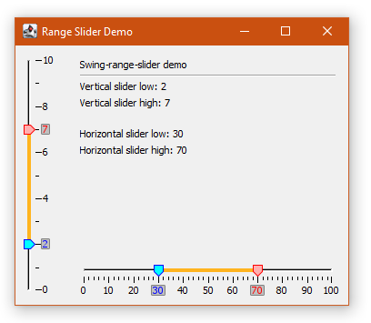

# Swing-range-slider
A custom swing range slider component. Originally forked from [ernieyu/Swing-range-slider](https://github.com/ernieyu/Swing-range-slider).
I decided to expand a little on the original codebase to better suit my needs. The changes are:
- Changed the shape of the slider thumbs to pointy "blocks"
- Added little indicators of the current value for both thumbs
- Fixed the range indicator issue in vertical display mode.

